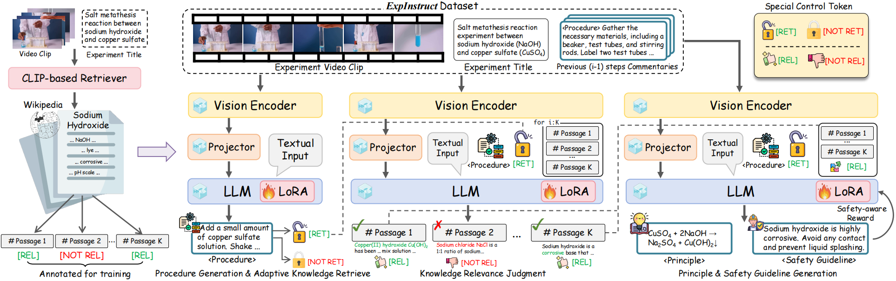

<div align="center">
# [ACM MM 2025] ExpStar: Towards Automatic Commentary Generation for Multi-discipline Scientific Experiments


## Abstract
Experiment commentary is crucial in describing the experimental procedures, delving into underlying scientific principles, and incorporating content-related safety guidelines.
In practice, human teachers rely heavily on subject-specific expertise and invest significant time preparing such commentary.
To address this challenge, we introduce the task of automatic commentary generation across multi-discipline scientific experiments.
While recent progress in large multimodal models (LMMs) has demonstrated promising capabilities in video understanding and reasoning, their ability to generate fine-grained and insightful experiment commentary remains largely underexplored.
In this paper, we make the following contributions:
1. **Dataset Construction**: We construct **ExpInstruct**, the first dataset tailored for experiment commentary generation, featuring over 7K step-level commentaries across 21 scientific subjects from 3 core disciplines . Each sample includes procedural descriptions along with potential scientific principles and safety guidelines.
2. **Novel Model**: We propose ExpStar, an automatic experiment commentary generation model that leverages a retrieval-augmented mechanism to adaptively access, evaluate, and utilize external knowledge. 
3. **Imperssive Result**:Extensive experiments show that our ExpStar substantially outperforms 16 leading LMMs, which highlights the superiority of our dataset and model.

We believe that ExpStar holds great potential for advancing AI-assisted scientific experiment instruction.


## ExpStar Model



## Data

The ExpInstruct dataset includes:
- 7K+ step-level commentaries
- 21 scientific subjects
- 3 core disciplines
- Procedural descriptions
- Scientific principles
- Safety guidelines

## ExpStar Workflow Guide

This section provides an overview of the ExpStar workflow, covering the complete process of data processing, model training, inference, and evaluation. The following describes the functions and usage of each module.

### Directory Structure

```
repo/
├── code/                # Main code directory
│   ├── 1video_commentary_pair_construction/  # Video-commentary pair construction
│   ├── 2dataset_construction/                # Dataset construction
│   ├── 3retrevial/                           # Retrieval-related code (supports multiple retrievers)
│   ├── 4train/                               # Training scripts
│   ├── 5infer/                               # Inference scripts
│   └── 6eval/                                # Evaluation scripts
├── Demo/                # Data and result examples
│   ├── 1data/           # Raw data (videos, ASR, steps, etc.)
│   ├── 2pair-data/      # Video-commentary pairs
│   ├── 3baseline_dataset/    # Baseline dataset
│   ├── 4Expstar_dataset/     # ExpStar dataset
│   ├── 5Expstar_rl_dataset/  # ExpStar_RL dataset
│   ├── 6Expstar_result/      # Inference result examples
│   └── 7eval/                # Evaluation data examples
└── README.md         # Project documentation (English)
```

### Data Processing Workflow

1. **Raw Data Cleaning**  
   - Located in `Demo/1data/`, including original videos, ASR transcripts, and experiment steps (some safety and principle information is automatically supplemented via GPT-4o).
2. **Video-Commentary Pair Construction**  
   - Use `code/1video_commentary_pair_construction/` to process and generate examples, see `Demo/2pair-data/`.
3. **Dataset Construction**  
   - Use `code/2dataset_construction/` to generate baseline, ExpStar, and ExpStar_RL datasets. Example outputs can be found in `Demo/3baseline_dataset/`, `Demo/4Expstar_dataset/`, and `Demo/5Expstar_rl_dataset/`.
4. **Retrieval-Augmented Generation (RAG)**  
   - See `code/3retrevial/`, supports various retrievers (e.g., CLIP, EVA_CLIP, ViCLIP) and retrieval methods.

### Model Training

- Recommended to use 4x A100 GPUs for training.
- Includes two-stage training: SFT (Supervised Fine-Tuning) and DPO (Direct Preference Optimization).
- Training scripts:
  - SFT: `code/4train/expstar_train.sh`
  - DPO: `code/4train/rl_dpo.sh`

### Inference Workflow

- Baseline inference uses single-turn dialogue, script: `code/5infer/baseline_data_infer.sh`
- ExpStar inference uses multi-turn dialogue with client-server mode:
  - Server: `code/5infer/deploy_multi_port.sh`
  - Client: `code/5infer/expstar_data_infer.py`
- Example inference results can be found in `Demo/6Expstar_result/`

### Evaluation

- Batch evaluation script: `code/6eval/batch_evaluate.py`
- Example evaluation data format: `Demo/7eval/`

### Additional Notes

- Demo examples are provided for each stage of data and results, facilitating reproduction and understanding of the workflow.
- The retrieval-augmented code refers to the [self-rag](https://github.com/AkariAsai/self-rag) project and supports flexible switching between different retrievers.

## Citation

If you find our work helpful, please consider citing:

```bibtex
@article{chen2025expstar,
  title={ExpStar: Towards Automatic Commentary Generation for Multi-discipline Scientific Experiments},
  author={Chen, Jiali and Jia, Yujie and Wu, Zihan and Yang, Jinyu and Chen, Jianpeng and Hei, Xusen and Xie, Jiayuan and Cai, Yi and Li, Qing},
  journal={arXiv preprint arXiv:2507.09693},
  year={2025}
}
```

## License

This project is under the [MIT License](LICENSE).

